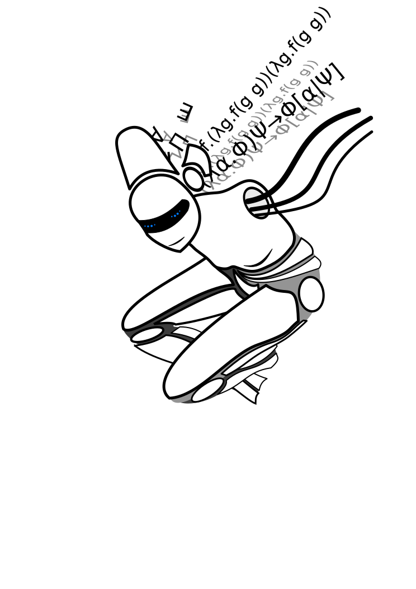

# Making a Nice Language
### An alternative guide to declarative programming

Lecturer: Arved Friedemann  
Time: Starting on the 30th of October, Wednesday, 14:00-15:00 with question session afterwards  
Venue: CF209

Abstract:
Have you ever wondered why so many programming languages look so complicated? There is absolutely no reason why they should, right? In this course, we will explore the concepts of how to make a language so nice that the code will even look like a text in human language. We will go into how to do symbolic computation, type systems, search and runtime optimization, but with one major goal: It should stay nice. Nice to understand, nice to read, and nice to implement. An alternative way of explaining declarative programming will be tested in order to ease the understanding. And how do we check that we are sticking to our word? Well: You will implement a compiler for your language (even if it is just on paper)! While doing that, you can tell us about your experience and we will shape the course together!
Don't worry if you are experienced. This course aims to spark discussions of where we should head in computer science, and you will learn something new, even if it is just a new viewpoint on what you are already doing. So please come along, no matter your skill level!

One disclaimer: As this is an experimental course, we cannot give credit points or other formal benefits to your degree. This course is one of those that can get you sparked to not only get a degree, but to become an actual computer SCIENTIST!

# Getting Started

What makes a language a good language?

<!--

-->
